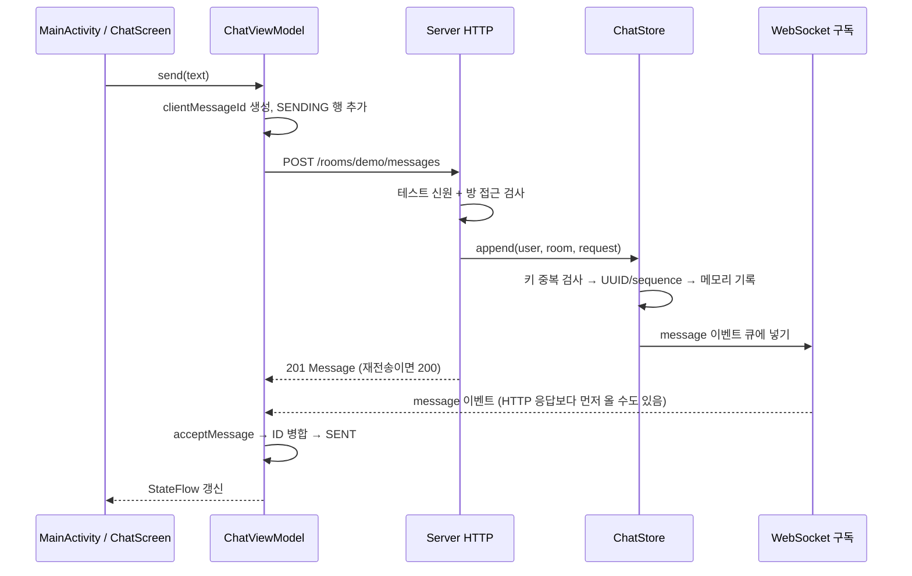

# 첫 채팅을 Android 개발자의 관점으로 읽기

이 코드의 중심은 예쁜 채팅 UI보다 **같은 논리 메시지가 여러 경로로 돌아올 때 하나의 상태로 합쳐지는 지점**이다. 서버 프레임워크와 Android 통신 라이브러리는 독립 선택이며 HTTP/WebSocket JSON 계약으로 만난다. Ktor 대신 Spring Boot 서버를 사용해도 이 계약과 Android의 병합 문제는 같다. 여기서는 익숙한 coroutine 흐름으로 작은 실행을 확인하려고 Ktor를 선택했다.

## 한 메시지가 지나가는 파일

1. [MainActivity.kt](app/src/main/kotlin/dev/chatlab/MainActivity.kt)의 `ChatScreen`은 입력과 전송 콜백만 안다. `ChatRoute`가 lifecycle과 ViewModel 수집을 연결한다. 서버 요청을 composable 본문에 넣지 않아 재구성에 따른 반복 전송을 피한다.
2. [ChatViewModel.kt](app/src/main/kotlin/dev/chatlab/ChatViewModel.kt)의 `send`는 UUID를 한 번 만들고 `SENDING` 행을 즉시 넣는다. 이 시점에는 서버가 아무것도 수락하지 않았다. Ktor Client가 POST를 보내며, 연결/전송 실패는 별도 결과다.
3. [Server.kt](server/src/main/kotlin/chatlab/Server.kt)는 업그레이드 전에도 테스트 신원과 방 멤버십을 검사한다. 본문의 senderId를 신뢰하지 않고 헤더로 검사한 신원을 사용한다. 단, 헤더는 누구나 흉내 낼 수 있는 로컬 테스트 신원이라 실제 인증이 아니다.
4. [ChatStore.kt](server/src/main/kotlin/chatlab/ChatStore.kt)의 `append`는 `(room, sender, clientMessageId)`를 검사한다. 새 요청이면 서버 UUID·sequence·시각을 부여하고 메모리 list에 넣은 뒤 구독 채널에 이벤트를 넣는다. **지금 ACK는 DB commit 뒤가 아니라 메모리 append 뒤에 나간다.**
5. WebSocket 이벤트와 HTTP 응답은 다른 경로다. 전송자 자신도 echo를 받는다. [ChatState.kt](app/src/main/kotlin/dev/chatlab/ChatState.kt)의 `acceptMessage`/`mergeMessage`가 두 결과를 같은 행으로 합친다. “HTTP 응답이 먼저 올 것”이라는 가정은 하지 않는다.

Android에서 Room 데이터와 네트워크 결과를 병합하던 문제와 닮았지만, 이 서버의 메모리 list는 Room처럼 내구성이 없다. 서버 프로세스가 사라지면 기록도 사라진다. `StateFlow`도 메시지를 안전하게 저장하거나 네트워크 전달을 보장해 주는 도구는 아니다.

## ID 세 개가 각각 답하는 질문

| 값 | 답하는 질문 | 범위·한계 |
|---|---|---|
| `clientMessageId` | 이것이 이전에 보낸 **같은 논리 요청**인가? | 클라이언트가 전송 전에 생성. 재시도할 때 유지해야 함 |
| 서버 `id` | 서버가 수락한 어떤 메시지인가? | HTTP 응답과 WS echo를 합치는 기준 |
| `sequence` | 이 방의 서버 기록에서 어떤 순서인가? | 현재 서버 프로세스 안에서만 증가. 재시작 시 초기화 |

POST가 서버에 도착했지만 응답이 오는 길에 끊겼다고 생각해 보자. 서버에는 메시지가 있고 Android에는 성공 응답이 없다. 여기서 새 UUID로 다시 보내면 서버는 새 메시지로 판단해 중복을 만든다. **같은 ID로 재시도해야** “이미 수락했으니 이전 결과를 돌려주겠다”가 가능하다. 같은 ID에 다른 text를 넣으면 요청의 정체성이 달라지므로 `409`다. text는 서버에서 앞뒤 공백을 제거한다.

이것은 모든 상황의 exactly-once 보장이 아니다. 지금 키와 기록은 메모리라 서버 재시작 후에는 같은 ID라도 새 메시지가 된다. 여러 서버 인스턴스에서도 잠금 하나를 공유하지 않는다. 영속 DB 도입 시 unique key·transaction·ACK 시점의 내구성 계약을 함께 바꿔야 한다.

## FAILED와 UNKNOWN을 나누는 이유

| 상태 | 우리가 아는 것 | 화면/다음 행동 |
|---|---|---|
| `SENDING` | 요청을 보내고 결과를 기다림 | 전송 중 |
| `SENT` | POST 결과 또는 WS echo로 이 서버의 수락을 확인 | 서버 수락. 상대 수신·읽음은 아직 모름 |
| `FAILED` | `400/401/403/409` 같은 명시적인 거절 | 입력·신원·방 접근·ID 충돌 이유 확인 |
| `UNKNOWN` | timeout/연결 끊김/서버 오류로 결과를 모름 | 서버가 수락했을 수도 있음. 기록 대조가 먼저 |

Android의 `Result.failure` 하나로 네트워크 오류를 모두 묶으면 “서버가 거절했다”와 “수락했지만 응답이 유실됐다”를 구분하지 못한다. 현재 화면은 UNKNOWN에서 자동 재전송하지 않는다. 다시 연결하면 snapshot으로 수락 여부를 대조한다. snapshot에 없다고 곧바로 미수락으로 단정할 수도 없다. 이전 POST가 아직 처리 중일 수 있기 때문이다. 추후 outbox와 같은-ID 재시도가 필요한 이유다.

WS echo가 먼저 성공을 확인한 뒤 POST가 timeout 나도 `SENT`를 실패로 되돌리지 않는다. 오류 문구도 같은 메시지의 서버 수락이 확인되면 추가하지 않거나 해제한다. 이는 [ChatStateTest.kt](app/src/test/kotlin/dev/chatlab/ChatStateTest.kt)의 두 순서 테스트로 검증한다.

## 처음 연결할 때 history와 이벤트 사이의 틈

단순하게 “GET history 완료 → WS 연결”을 하면 그 사이에 전송된 메시지를 놓칠 수 있다. 반대로 “WS 연결 → GET history”는 중복이 생길 수 있다. 이번 서버는 첫 WS 구독에서 **snapshot을 큐에 넣고 구독을 등록하는 일을 같은 잠금 안에서 처리**한다. `append`도 같은 잠금을 사용하므로 한 메시지는 snapshot에 있거나 이후 이벤트에 있다.

Android는 sequence로 정렬하고 ID로 중복 병합한다. 느린 구독자의 64개 버퍼가 넘치면 서버는 이벤트를 몰래 버리지 않고 해당 연결을 닫는다. 화면 진입·복귀 시 연결하며, 연결 중 장애 뒤 백오프 자동 재시도는 아직 없다. 버튼으로 다시 연결하면 새 snapshot을 받는다. 이 첫 구현은 증분 cursor·영속 outbox·서버 재시작을 넘는 복구까지 보장하지 않는다.

## 손으로 재현할 한 가지

서버가 실행 중일 때 `bash scripts/idempotency-demo.sh`를 실행한다.

- 첫 POST: `201`, 새 서버 ID와 sequence.
- 같은 키·같은 본문 POST: `200`, **동일** ID와 sequence, history 증가 없음.
- 같은 키·다른 본문 POST: `409`, history 증가 없음.

직접 더 관찰하려면 앱을 연결한 채 실행한다. POST를 두 번 했는데 화면에 새 행은 한 개만 생기는지 본다. REST 재전송에 WS 이벤트를 다시 발행하지 않기 때문이다. 이것이 “재시도 횟수”와 “논리 메시지 수”가 다른 가장 작은 사례다.

다음 한 가지는 **수락 응답을 잃어 UNKNOWN이 된 요청을 같은 ID로 재시도해 한 행으로 복구하는 실험**이다. 그 뒤에 영속 outbox/DB가 필요해지는 정확한 실패 경계를 붙이면 된다.
