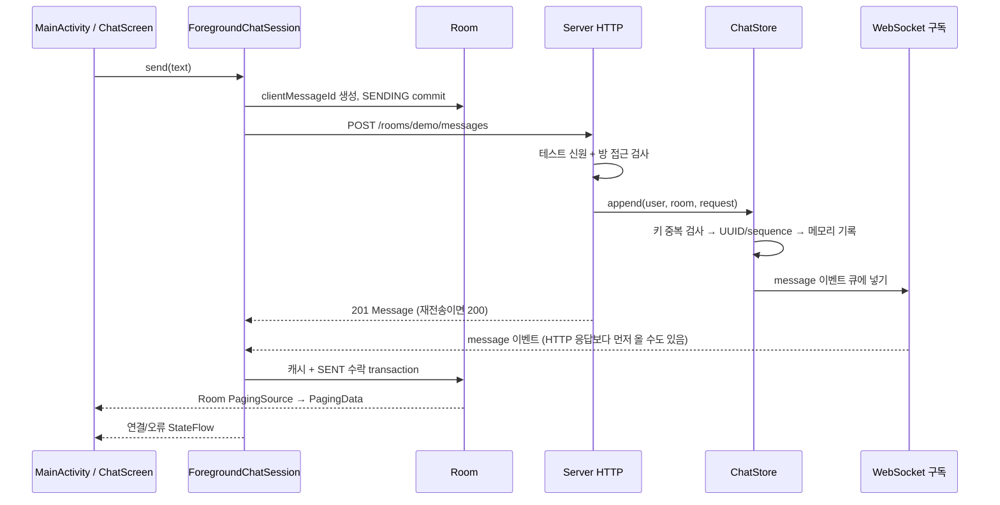
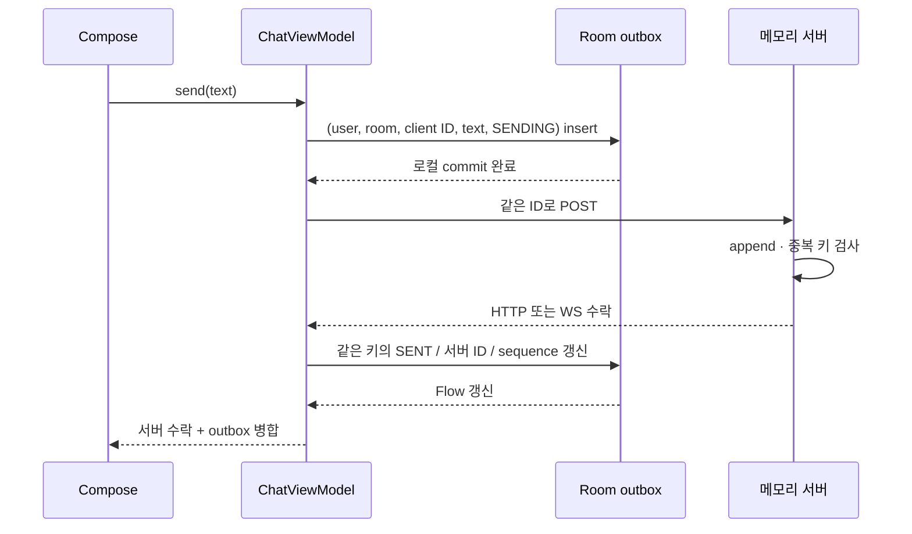

# 첫 채팅을 Android 개발자의 관점으로 읽기

이 코드의 중심은 예쁜 채팅 UI보다 **같은 논리 메시지가 여러 경로로 돌아올 때 하나의 상태로 합쳐지는 지점**이다. 서버 프레임워크와 Android 통신 라이브러리는 독립 선택이며 HTTP/WebSocket JSON 계약으로 만난다. Ktor 대신 Spring Boot 서버를 사용해도 이 계약과 Android의 병합 문제는 같다. 여기서는 익숙한 coroutine 흐름으로 작은 실행을 확인하려고 Ktor를 선택했다.

## 한 메시지가 지나가는 파일



1. [MainActivity.kt](app/src/main/kotlin/dev/chatlab/MainActivity.kt)의 `ChatScreen`은 입력과 전송 콜백만 안다. `ChatRoute`가 lifecycle과 ViewModel 수집을 연결한다. 서버 요청을 composable 본문에 넣지 않아 재구성에 따른 반복 전송을 피한다.
2. [ForegroundChatSession.kt](app/src/main/kotlin/dev/chatlab/ForegroundChatSession.kt)의 `send`는 UUID를 한 번 만들고 Room에 `SENDING` 행을 저장한 뒤 POST한다. 이 시점에는 서버가 아무것도 수락하지 않았다. Ktor Client가 POST를 보내며, 연결/전송 실패는 별도 결과다.
3. [Server.kt](server/src/main/kotlin/chatlab/Server.kt)는 업그레이드 전에도 테스트 신원과 방 멤버십을 검사한다. 본문의 senderId를 신뢰하지 않고 헤더로 검사한 신원을 사용한다. 단, 헤더는 누구나 흉내 낼 수 있는 로컬 테스트 신원이라 실제 인증이 아니다.
4. [ChatStore.kt](server/src/main/kotlin/chatlab/ChatStore.kt)의 `append`는 `(room, sender, clientMessageId)`를 검사한다. 새 요청이면 서버 UUID·sequence·시각을 부여하고 메모리 list에 넣은 뒤 구독 채널에 이벤트를 넣는다. **지금 ACK는 DB commit 뒤가 아니라 메모리 append 뒤에 나간다.**
5. WebSocket 이벤트와 HTTP 응답은 다른 경로다. 전송자 자신도 echo를 받는다. [MessageCache.kt](app/src/main/kotlin/dev/chatlab/MessageCache.kt)의 transaction이 두 결과를 같은 저장 행으로 합친다. “HTTP 응답이 먼저 올 것”이라는 가정은 하지 않는다.

Android에서 Room 데이터와 네트워크 결과를 병합하던 문제와 닮았지만, 이 서버의 메모리 list는 Room처럼 내구성이 없다. 서버 프로세스가 사라지면 기록도 사라진다. `StateFlow`도 메시지를 안전하게 저장하거나 네트워크 전달을 보장해 주는 도구는 아니다.

## ID와 순서가 각각 답하는 질문

| 값 | 답하는 질문 | 범위·한계 |
|---|---|---|
| `clientMessageId` | 이것이 이전에 보낸 **같은 논리 요청**인가? | 클라이언트가 전송 전에 생성. 재시도할 때 유지해야 함 |
| 서버 `id` | 서버가 수락한 어떤 메시지인가? | HTTP 응답과 WS echo를 합치는 기준 |
| `serverInstanceId` | 어느 서버 실행의 기록인가? | 재시작 시 새 UUID. 서버 영속 저장은 아님 |
| `sequence` | 이 방의 서버 기록에서 어떤 순서인가? | 현재 서버 프로세스 안에서만 증가. 재시작 시 초기화 |

POST가 서버에 도착했지만 응답이 오는 길에 끊겼다고 생각해 보자. 서버에는 메시지가 있고 Android에는 성공 응답이 없다. 여기서 새 UUID로 다시 보내면 서버는 새 메시지로 판단해 중복을 만든다. **같은 ID로 재시도해야** “이미 수락했으니 이전 결과를 돌려주겠다”가 가능하다. 같은 ID에 다른 text를 넣으면 요청의 정체성이 달라지므로 `409`다. text는 서버에서 앞뒤 공백을 제거한다.

이것은 모든 상황의 exactly-once 보장이 아니다. 지금 키와 기록은 메모리라 서버 재시작 후에는 같은 ID라도 새 메시지가 된다. 여러 서버 인스턴스에서도 잠금 하나를 공유하지 않는다. 영속 DB 도입 시 unique key·transaction·ACK 시점의 내구성 계약을 함께 바꿔야 한다.

## FAILED와 UNKNOWN을 나누는 이유

| 상태 | 우리가 아는 것 | 화면/다음 행동 |
|---|---|---|
| `SENDING` | 요청을 보내고 결과를 기다림 | 전송 중 |
| `SENT` | POST 결과 또는 WS echo로 이 서버의 수락을 확인 | 서버 수락. 상대 수신·읽음은 아직 모름 |
| `FAILED` | `400/401/403/409` 같은 명시적인 거절 | 입력·신원·방 접근·ID 충돌 이유 확인 |
| `UNKNOWN` | timeout/연결 끊김/서버 오류로 결과를 모름 | 서버가 수락했을 수도 있음. 기록 대조가 먼저 |

Android의 `Result.failure` 하나로 네트워크 오류를 모두 묶으면 “서버가 거절했다”와 “수락했지만 응답이 유실됐다”를 구분하지 못한다. 현재 화면은 UNKNOWN에서 자동 재전송하지 않는다. 다시 연결하면 최신 20개 bootstrap으로 최근 수락을 대조한다. 같은 서버 실행의 저장된 기준점 이후 빠진 행은 after 복구로 대조한다. 기준점 이전의 미확인 행은 과거 조회 또는 같은 ID 수동 retry로 확인해야 한다. snapshot에 없다고 곧바로 미수락으로 단정할 수도 없다. 이전 POST가 아직 처리 중일 수 있기 때문이다. 현재 Room outbox와 같은-ID 수동 재시도를 사용하는 이유다.

WS echo가 먼저 성공을 확인한 뒤 POST가 timeout 나도 `SENT`를 실패로 되돌리지 않는다. 오류 문구도 같은 메시지의 서버 수락이 확인되면 추가하지 않거나 해제한다. DB 수락/실패 순서는 Room instrumentation으로, 화면 오류 해제는 [ChatStateTest.kt](app/src/test/kotlin/dev/chatlab/ChatStateTest.kt)로 검증한다.

## 처음 연결할 때 history와 이벤트 사이의 틈

단순하게 “GET history 완료 → WS 연결”을 하면 그 사이에 전송된 메시지를 놓칠 수 있다. 반대로 “WS 연결 → GET history”는 중복이 생길 수 있다. 이번 서버는 첫 WS 구독에서 **snapshot을 큐에 넣고 구독을 등록하는 일을 같은 잠금 안에서 처리**한다. `append`도 같은 잠금을 사용하므로 최신 tail의 메시지는 첫 페이지에 있고, bootstrap 시점 이후 메시지는 live 이벤트에 있다. 첫 페이지보다 오래된 기록은 before 페이지로 읽는다.

Android는 sequence로 정렬하고 ID로 중복 병합한다. 느린 구독자의 64개 버퍼가 넘치면 서버는 이벤트를 몰래 버리지 않고 해당 연결을 닫는다. 앱 프로세스의 전경 진입·복귀 시 연결하며, 연결 중 장애 뒤 백오프 자동 재시도는 아직 없다. 버튼으로 다시 연결하면 새 snapshot을 받는다. 현재 before 과거 cursor와 별도 after 누락 복구가 있으며 outbox와 관찰한 수신 기록은 Room에 남는다.

## 손으로 재현할 한 가지

서버가 실행 중일 때 `bash scripts/idempotency-demo.sh`를 실행한다.

- 첫 POST: `201`, 새 서버 ID와 sequence.
- 같은 키·같은 본문 POST: `200`, **동일** ID와 sequence, history 증가 없음.
- 같은 키·다른 본문 POST: `409`, history 증가 없음.

직접 더 관찰하려면 앱을 연결한 채 실행한다. POST를 두 번 했는데 화면에 새 행은 한 개만 생기는지 본다. REST 재전송에 WS 이벤트를 다시 발행하지 않기 때문이다. 이것이 “재시도 횟수”와 “논리 메시지 수”가 다른 가장 작은 사례다.

## 두 번째 학습 단위: timeout이 서버 기록을 지우지는 않는다

Android 화면의 coroutine을 취소하거나 HTTP 요청에 timeout을 걸면 앱의 기다림은 끝난다. 이미 완료된 Room insert를 화면의 Job 취소로 없앨 수 없듯, **이미 서버가 append한 메시지도 앱의 timeout으로 되돌릴 수 없다.** 다만 Room transaction 내부의 취소·rollback과 이 비유를 혼동하면 안 된다. 앱과 서버는 서로 다른 프로세스이고 하나의 transaction이나 cancellation tree를 공유하지 않는다. 처리 도중 연결 끊김이 서버 작업을 취소하는지는 서버 구현에 달려 있다. 이번 실험은 서버 append 완료 **후** 알림을 못 받는 구간을 다룬다.

실제 전송 경로는 `앱 → 로컬 테스트 프록시 → 기존 서버`다. [AckLossProxy.kt](server/src/test/kotlin/chatlab/AckLossProxy.kt)는 요청을 서버에 전달하고 수락 응답을 받은 뒤 앱에 전달할 응답을 60초 늦춘다. 앱은 기존 8초 timeout으로 기다림을 끝낸다. 따라서 “서버가 수락했는가”와 “앱이 HTTP 결과를 받았는가”를 분리해 관찰할 수 있다. 일반 서버 API에 실패 제어를 넣지 않았고, 프록시는 테스트 source set에서 명시 실행할 때만 loopback에 열린다. 앱도 debug에서만 고정 로컬 실험 모드를 선택한다.

| 실험 | 앱이 받은 수락 근거 | 결과 |
|---|---|---|
| `both` | HTTP도 없고 그 ID의 WS 이벤트도 없음 | `SENDING → UNKNOWN`; 서버 history에는 이미 있음 |
| `http-only` | HTTP는 없지만 WS 이벤트가 있음 | WS로 `SENT`가 됨; 나중 HTTP timeout도 SENT를 유지 |

`UNKNOWN`은 “서버가 실패했다”가 아니라 **내가 결과를 모른다**는 뜻이다. 반면 잘못된 본문·접근 거절·키 충돌처럼 서버가 명시적으로 거절한 것은 `FAILED`다. 요청이 서버까지 도달하지 않은 연결 실패와, 이번처럼 수락 뒤 응답이 유실된 경우는 같은 timeout 문구만으로 구분할 수 없다. 이 실험은 서버 history·프록시 수락 로그를 함께 대조해 후자임을 확인한다.

### 같은 행을 재시도하는 코드

[ChatState.kt](app/src/main/kotlin/dev/chatlab/ChatState.kt)의 `retryRequest`는 연결된 자신의 `UNKNOWN` 행에서 **기존 ID와 저장된 본문**을 꺼낸다. [ForegroundChatSession.kt](app/src/main/kotlin/dev/chatlab/ForegroundChatSession.kt)의 `retry`는 해당 행을 compare-and-set으로 `SENDING`으로 바꾼 뒤 `send`와 같은 `submit` 경로에 보낸다. 두 번 눌러도 두 번째는 이미 SENDING이라 claim할 수 없다. 그 사이 WS 수락이 도착해 SENT가 됐다면 claim이 실패하거나 수락 상태를 유지한다.

서버는 첫 요청을 이미 기록했으므로 재시도에 `200`과 원래 서버 ID·sequence를 돌려준다. 앱은 같은 캐시 저장 경로로 outbox를 SENT로 바꾸며 중복 행을 추가하지 않는다. HTTP 응답과 WS event의 순서를 가정하지 않는다.

### 직접 따라하기: 두 알림 유실

기존 서버는 계속 실행한다. 별도 터미널에서 프록시를 실행한다.

```bash
./gradlew :server:ackLossProxy -Pscenario=both --console=plain
```

debug APK를 빌드·설치한 뒤 관찰한 device serial로 학습 모드를 시작한다. ADB가 여러 버전이면 `CHAT_ADB`로 SDK의 platform-tools/adb를 선택한다.

```bash
bash scripts/ack-loss-lab.sh both emulator-5554
```

1. 화면의 실험 제목과 연결됨을 확인하고 Alice로 `loss1`을 한 번 보낸다. 앱을 foreground에 둔다.
2. 8초 뒤 `결과 미확인`과 `같은 ID로 재시도`가 나타난다. 이때 다시 연결하거나 앱을 재시작하지 않는다. 새 snapshot을 받으면 이미 수락을 확인해 SENT가 되기 때문이다.
3. 다른 터미널에서 아래 history를 확인한다. 앱은 UNKNOWN이지만 서버에는 메시지와 서버 ID·sequence가 있다.
4. 화면의 같은 ID 재시도를 누른다. client ID가 유지되고 한 행만 서버 수락으로 바뀌는지 본다. history도 다시 조회해 ID·sequence·개수가 그대로인지 확인한다.

```bash
curl -s -H 'X-Test-User: alice' http://127.0.0.1:8080/rooms/demo/messages
```

비교하고 싶으면 별도 `http-only` 프록시(`-Pscenario=http-only`, 8082)를 실행하고 `bash scripts/ack-loss-lab.sh http-only emulator-5554`로 새 학습 세션을 시작한다. 새 메시지는 WS로 즉시 서버 수락이 되며 8초 후에도 UNKNOWN/재시도 버튼이 생기지 않는다. 각 프록시는 첫 Alice POST 한 번만 주입하므로 같은 실험을 반복할 때는 해당 프록시만 Ctrl+C 후 재실행한다.

두 번째 단위까지는 앱 프로세스가 끝나면 미확인 로컬 행이 사라졌고, 서버 프로세스가 끝나면 수락 기록과 중복 키가 사라졌다. 아래 세 번째 단위는 앞의 클라이언트 경계를 Room으로 보완한다. 서버 메모리 계약은 그대로다.

## 세 번째 학습 단위: Room outbox와 프로세스 종료

Room CRUD는 이미 알고 있으므로 **어떤 경계에서 무엇을 알 수 있는가**에 집중한다. 세 번째 단위 당시에는 자신의 송신 의도와 수락 영수증만 Room에 넣었다. 이후 캐시와 Paging을 추가했다. 당시 UI는 `Room의 미확인/거절 행 + 현재 서버에서 받은 수락 메시지`를 병합한다.



### 두 commit 사이에는 transaction이 없다

[Outbox.kt](app/src/main/kotlin/dev/chatlab/Outbox.kt)의 `OutboxEntry`는 `(userId, roomId, clientMessageId)`를 primary key로 사용한다. ID·정규화된 text·status·로컬 생성 시각·수락된 serverId/sequence가 저장된다. `ChatApplication`이 프로세스당 하나의 DB/store를 가진다. [ForegroundChatSession.kt](app/src/main/kotlin/dev/chatlab/ForegroundChatSession.kt)는 `outbox.enqueue(entry)`가 성공한 다음 POST한다. 저장 실패면 POST하지 않고 입력을 유지한다. 입력을 지우는 기준도 버튼 클릭이 아니라 로컬 저장 완료다.

| 종료/실패 위치 | 남는 정보 | 다음 실행의 해석 |
|---|---|---|
| 로컬 commit 전 | 송신 의도 없음, POST도 시작하지 않음 | 입력 유지. 다시 전송할 때 새 의도 생성 |
| 로컬 commit 후, POST 전 | SENDING, 서버에 도착하지 않았을 수 있음 | UNKNOWN으로 복구, 동일 ID 수동 재시도 가능 |
| 서버 수락 후, HTTP/WS 수신 전 | 로컬 SENDING/UNKNOWN, 서버에는 이미 있을 수 있음 | UNKNOWN. snapshot으로 대조하거나 동일 ID 재시도 |
| 앱이 수락을 받았지만 로컬 receipt 갱신 전 | DB에는 아직 SENDING일 수 있음 | 다음 실행은 UNKNOWN; snapshot/같은 ID로 재확인 |
| 로컬 SENT 갱신 후 | 수락 영수증 있음 | 늦은 timeout/거절로 SENT를 되돌리지 않음 |

Room transaction은 로컬 SQLite 원자성을 제공한다. 서버 append까지 묶어서 commit하는 transaction은 아니다. 둘 사이에 프로세스 종료가 들어갈 수 있으므로 outbox가 필요한 것이다. `SENDING`을 저장했다는 사실만으로 POST가 서버에 도달했다고 말할 수 없고, 반대로 HTTP timeout만으로 서버 미수락이라고 말할 수 없다.

### 죽은 SENDING과 살아 있는 요청을 구분하기

새 프로세스의 `OutboxStore.initialize()`는 이전 SENDING을 UNKNOWN으로 바꾼다. 이전 coroutine은 살아 있지 않지만 이미 서버에 도달한 요청은 처리됐을 수 있기 때문이다. DB의 ID·본문·계정·방·생성 시각은 유지한다. **복구가 자동 재전송은 아니다.**

이 초기화는 프로세스당 한 번이다. 계정을 바꾸거나 WS를 다시 연결할 때 반복하면, 같은 프로세스의 살아 있는 HTTP 요청까지 UNKNOWN으로 바꿔 중복 retry를 허용할 수 있다. ProcessLifecycleOwner ON_STOP은 WS/송신 상태 관찰을 정리하지만 HTTP 결과는 원래 계정·방의 DB에 계속 반영할 수 있다. HTTP job이 정상적으로 취소되면 guarded UNKNOWN 갱신을 시도하고, hard kill에는 그 정리 코드가 실행되지 않으므로 다음 프로세스의 복구가 담당한다.

### StateFlow CAS에서 DB 조건부 갱신으로

이전 retry는 메모리의 compare-and-set으로 행을 claim했다. 이제 `OutboxDao.claimRetry()`의 transaction이 정확한 `(user, room, ID)`의 **UNKNOWN + serverId 없음**을 조건으로 SENDING으로 바꾸고 원래 행을 읽는다. 갱신 수가 1인 요청만 POST한다. 두 번 누르면 두 번째 갱신 수는 0이다. 취소된 transaction은 claim을 rollback한다.

HTTP·WS 수락은 `OutboxStore.accept()`/`acceptSnapshot()`으로 동일 행을 갱신한다. 다른 sender/room 메시지로 자신의 outbox를 수락 처리하지 않는다. 다른 계정으로 화면을 바꾼 뒤 이전 HTTP가 끝나도 원래 키의 DB만 갱신하고, generation 검사가 새 계정의 UI 갱신을 막는다. 늦은 실패 갱신은 SENDING이면서 serverId가 없는 행에만 적용하므로 이미 SENT인 receipt를 되돌릴 수 없다.

세 번째 단위는 메모리 서버 행과 outbox Flow를 화면에서 병합했다. 네 번째 단위는 이를 제거하고 같은 DB transaction과 한 SQL projection으로 읽는다. 따라서 미확인 행과 수락 행이 한 논리 메시지를 두 줄로 만들지 않는다.

### 로컬 receipt와 서버의 현재 history는 다르다

완료된 SENT receipt도 DB에 남겨 늦은 실패를 막는다. 세 번째 단위는 receipt만으로 과거 history를 만들어내지 않았다. 네 번째 단위부터 실제 관찰한 수신 본문도 별도 캐시에 보존하며 서버 실행 ID를 표시한다. 이번 서버는 메모리이므로 이전 수락 기록과 idempotency 키가 사라진다. **클라이언트 outbox 영속성과 서버 중복 방지 영속성은 별개다.** UNKNOWN을 같은 ID로 재시도해도 서버가 재시작했다면 새로운 서버 ID·sequence로 수락할 수 있다. 이번 구조를 exactly-once나 영속 서버 저장 보장으로 설명하면 안 된다.

### 직접 종료·재실행하기

`adb shell am force-stop dev.chatlab`은 이 앱 프로세스를 종료하지만 DB 데이터는 지우지 않는다. `pm clear`, 앱 삭제, 새 AVD의 데이터 초기화는 다른 실험이며 이번 검증에는 사용하지 않았다.

1. ACK 유실 또는 연결 실패로 자신의 UNKNOWN 행을 만든다. ID·본문·서버 history를 기록한다.
2. 이 앱만 force-stop한다. 해당 모드의 ADB reverse를 제거하고 재실행하면 서버 snapshot 없이 Room 복구만 관찰할 수 있다. BOTH 모드는 8081, 기본 모드는 8080이다.
3. 같은 ID·본문·UNKNOWN이 남았는지 본다. Bob으로 바꿨을 때 Alice의 미확인 행이 보이지 않고, Alice로 돌아가면 복구되는지 본다.
4. reverse와 연결을 복원한다. 서버에 이미 있던 메시지는 snapshot으로 SENT가 되고, 서버에 없던 미확인 메시지는 같은 ID 수동 재시도로 보낸다. 자동 POST는 없다.

멈춘 debug 앱의 DB와 WAL을 함께 읽어 로컬 증거로 저장할 수 있다. 실행 중 DB를 따로 복사하면 서로 다른 시점의 main DB/WAL이 섞일 수 있으므로 스크립트는 프로세스가 멈췄는지 먼저 검사한다. 자신의 테스트 DB만 `evidence`에 저장하며 공개 Git에서는 제외한다.

```bash
adb -s emulator-5554 shell am force-stop dev.chatlab
bash scripts/capture-outbox-db.sh emulator-5554 after-stop
```

실제 [DB instrumentation 테스트](app/src/androidTest/kotlin/dev/chatlab/OutboxDatabaseTest.kt)는 DB 재열기, SENDING 복구, 계정·방 키 격리, 24개 동시 claim, 수락/실패 순서, 중복 receipt, snapshot 대조와 취소 rollback을 검사한다. 버전 1 schema는 `app/schemas`에 공개 관리한다. 스키마를 바꿀 때 migration을 추가해야 하며 destructive fallback은 사용하지 않았다.

### 수신 캐시 이후 과거 페이징

아래 네 번째 단위에서 **수신 기록도 Room에 넣어 HTTP·WS·outbox 수락이 동일 메시지 저장소로 모이게 했다**. 그 뒤 서버 cursor 과거기록 조회와 Room PagingSource를 연결한다. UI가 네트워크 결과를 직접 목록에 추가하는 대신 DB를 읽고, 중복 저장 검사가 실시간/과거 페이지의 겹침을 처리하도록 확장한다.

과거 기록 페이징과 재접속 누락 보충은 같은 문제가 아니다. 전자는 이미 가진 가장 오래된 기록 이전을 가져오고, 후자는 마지막으로 확인한 순서 이후 빠진 메시지를 보충한다. 이 경계와 실시간 수신 중 스크롤 앵커를 검증한 뒤 Paging3/RemoteMediator 필요성을 판단한다. 다섯 번째 단위에서 Room Paging과 로컬 Push adapter를 추가했다. 여섯 번째 단위에서 after catch-up을 추가했다. 서버 DB와 실제 FCM 전달은 아직 없다.

공식 참고: [Room 의존성·schema 설정](https://developer.android.com/jetpack/androidx/releases/room), [실제 기기에서 Room DB 테스트](https://developer.android.com/training/data-storage/room/testing-db), [Room transaction API](https://developer.android.com/reference/kotlin/androidx/room/package-summary#withTransaction(androidx.room.RoomDatabase,kotlin.coroutines.SuspendFunction0)).

## 네 번째 학습 단위: 화면의 메시지는 Room에서만 나온다

[15분 능동 실습](CACHE_EXERCISE.md)에서 먼저 결과를 예상하세요. 네 번째 단위의 저장 경로는 현재 다음 Paging 읽기로 이어집니다.

```text
HTTP history / WS snapshot / WS message / POST 수락
  → ChatRepository → MessageCacheStore의 page/message 병합
  → Room transaction: immutable 캐시 삽입 + 자신의 outbox 수락
  → MessageDao.pagingSource(계정, 방): 캐시 + 미수락 outbox SQL projection
  → 프로세스 scope의 Pager.cachedIn
  → ChatRoute의 LazyPagingItems → ChatScreen
```

ViewModel은 네트워크 콜백에서 messages를 직접 바꾸지 않습니다. 로컬 DB 저장 실패를 메모리 목록으로 숨기지도 않습니다. 오류/연결/queueing은 일시적인 화면 상태이며, 메시지 본문과 전송 상태는 DB projection으로 읽습니다. enqueue/retry는 이전 단위처럼 저장 완료 뒤 POST하며 UNKNOWN 자동 재전송은 없습니다.

HTTP와 WS는 도착 순서를 보장하지 않습니다. 먼저 #2 이벤트를 저장한 뒤 오래 걸린 #1 history가 도착해도 snapshot은 추가 병합이라 #2를 지우지 않습니다. 실행 UUID+서버 ID가 같고 데이터도 같으면 중복입니다. 같은 키에 다른 본문이나 sequence가 오면 덮어쓰지 않고 transaction을 실패시키며 저장 오류를 표시합니다. 논리 client ID와 sequence에도 실행별 unique 제약이 있습니다.

`ownerId`는 이 기록을 관찰한 로그인 후보이고 `senderId`는 보낸 사람입니다. Alice가 Bob 메시지를 받으면 owner=Alice/sender=Bob입니다. 계정 전환 뒤 늦은 HTTP 수락은 원래 owner/room에 저장하고 generation 검사가 새 화면 갱신을 막습니다. 다른 계정의 기록을 화면에 합치지 않습니다. 이 신원 전환은 로컬 개발 도구이며 실제 인증은 아닙니다.

cache와 outbox 수락은 같은 로컬 transaction입니다. 화면 SQL은 수신 캐시와 SENT가 아닌 outbox만 합칩니다. 수락 순간 pending과 accepted 두 복사본을 노출하지 않으며 자신의 UI key도 유지합니다. 이미 SENT인 영수증은 늦은 timeout이나 새 서버의 다른 수락으로 되돌리지 않습니다. v1 SENT 영수증의 실행 ID는 알 수 없으므로 null로 보존하고 과거 수신 본문을 임의로 만들어내지 않습니다.

서버 실행마다 UUID가 달라집니다. #1은 실행 안에서만 의미가 있어 재시작 후 새 #1을 이전 #1에 덮어쓰면 안 됩니다. DB는 실행을 처음 관찰한 그룹 순서와 그 안의 sequence로 정렬하며 미수락 행을 마지막에 로컬 생성 순서로 표시합니다. 이것은 클라이언트 관찰 순서이며 서버 간 전역 시간순이 아닙니다. UI의 실행 ID로 경계를 확인합니다.

DB v2는 기존 outbox를 보존하는 1→2 auto migration입니다. schema JSON은 DB 내용 없이 Git에 관리합니다. migration 테스트는 실제 schema1 JSON으로 임시 v1 SQLite DB를 만들고 UNKNOWN/SENDING/SENT를 넣은 뒤 Room v2로 열어 필드 보존과 schema 검사를 확인합니다. destructive fallback은 없습니다.

수신 캐시는 서버 영속 저장·완전한 history·누락 복구가 아닙니다. 서버가 종료되면 아직 이 기기가 관찰하지 않은 메시지는 사라집니다. 현재 `(serverInstanceId, sequence)` before cursor와 Room Paging으로 과거 조회/실시간 경계를 검증합니다. 여섯 번째 단위는 after 누락 보충을 추가합니다.

## 다섯 번째 학습 단위: DB 위치 key와 서버 before는 다르다

[과거 페이지 실습](PAGING_EXERCISE.md)의 #1–#85 예측부터 적어보세요. 첫 WS 페이지는 #66–#85입니다. subscribe와 page 생성이 같은 append lock 안에 있어 초기 latest 조회 뒤 구독까지의 틈이 없습니다. 이후 #86은 live로 저장됩니다. before #66은 sequence <66이므로 새 append와 무관하게 #46–#65를 반환합니다.

`HistoryKey`는 계정·방·서버 실행별 서버 탐색 경계입니다. `PagingSource<Int, MessageRow>`의 Int는 Room의 몇 번째 행을 읽을지 정하는 DB 위치입니다. HTTP 페이지 응답은 캐시와 HistoryKey를 한 transaction으로 저장한 뒤 Room이 PagingSource를 invalidate합니다. 화면은 네트워크 목록을 따로 합치지 않습니다. 서버 경계와 DB key를 드러내려고 이번 작은 coordinator는 RemoteMediator를 사용하지 않았습니다.

과거 응답은 요청 oldestSequence 바로 전까지 연속되어야 합니다. 실패/본문 충돌/다른 실행은 transaction을 전진시키지 않습니다. 늦은 중복 응답은 유효한 본문을 합칠 수 있지만 이미 진행한 cursor를 되돌리지 않습니다. 과거를 읽을 때 새 메시지는 stable key/offset을 유지하고, 최신 끝을 따라가는 사용자는 새 메시지를 바로 봅니다.

`ChatViewModel`은 UI 명령을 프로세스 세션에 위임합니다. `ProcessLifecycleOwner`가 전경 WS를 시작하고 배경에서 취소합니다. Activity 재생성은 소켓 소유권을 바꾸지 않습니다. 별도 `LocalPushAdapter`는 현재 화면 계정이 아니라 delivery 경계가 제공한 boundAccount로 같은 repository/Room에 저장합니다. 중복/늦은 Push와 WS/HTTP가 겹쳐도 한 캐시 행입니다. 실제 FCM 수신과 권한 UX는 [배경 계약](BACKGROUND_CONTRACT.md)의 후속 입력이 필요합니다.

복귀 최신 20개만으로는 모든 누락을 보충하지 못합니다. before를 끝까지 읽는 과거 탐색과 연속 확인 sequence 이후의 after catch-up은 다른 실행입니다. 다음 한 가지는 누락 100개를 bounded after 페이지로 자동 보충하고 live와 합칠 때의 경계를 검증하는 것입니다.

## 여섯 번째 학습 단위: max(sequence)는 연속 확인 지점이 아니다

[예측·실행·새 테스트 실습](CATCH_UP_EXERCISE.md)을 먼저 읽는다. 처음 #66–#85는 base65/confirmed85다. 배경 동안120개가 추가되면 복귀 tail #186–#205의 max는205지만 confirmed는85다. 이를205로 저장하면 #86–#185를 영원히 건너뛸 수 있다.

SyncCursor의 base/contiguousThrough/requestedThrough는 계정·방·서버 실행별이다. 높은 이벤트는 target만 올린다. MessageCacheStore는 cursor 바로 다음 sequence가 DB에 실제로 있을 때만 연속 확장한다. 각 HTTP after 페이지와 outbox receipt/cursor를 한 transaction으로 저장한다. 페이지당20개와 고정 through를 검증하며 누락/충돌은 rollback한다. before HistoryKey와 after SyncCursor는 서로 소비하지 않는다.

ForegroundChatSession은 WS bootstrap commit 뒤 공통 SyncCoordinator를 실행한다. WS 이벤트는 HTTP를 기다리지 않고 같은 캐시에 저장한다. 계정·방 Mutex는 중복 sync를 직렬화하지만 Room의 immutable key 검사가 늦은 응답과 중복을 처리한다. commit된 페이지는 프로세스 종료 뒤 남고 다음 실행은 해당 contiguous부터 재개한다. 배경/계정 전환은 전경 job을 취소하고 generation이 새 UI로의 반영을 막는다.

FCM은 기록 자체를 보장하는 저장소가 아니다. 최신 Android SDK는 FID 등록 모드의 register/onRegistered를 제공한다. FIS ID와 FCM 등록 receipt는 다르며 SDK callback이 확인한 receipt만 private binding에 저장한다. prepared service는 독립 boundAccount로 hint를 검증하고 Room에 target을 남긴 뒤 worker에 HTTP 복구를 맡긴다. worker는 WS를 열지 않는다. 기본 SDK 자동 초기화/등록은 꺼져 있고 [프로젝트·CLI 선택](FCM_SETUP.md)이 필요하다. 실제 외부 전달은 아직 검사하지 않았다.

이번 실제 검증은 실패한 after105에서 새 프로세스가 이어받고, 복구 중 먼저 받은 #206까지 합쳐 #66–#206의141개가 모두 일치하는 것을 확인한다. base 이전65개는 before 조회 대상이다. 이전 메모리 서버 실행의 사라진 기록이나 서버 영속성을 복구했다고 해석하지 않는다.
